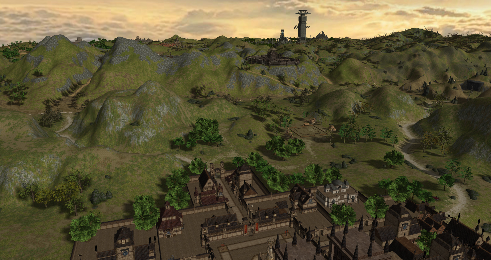
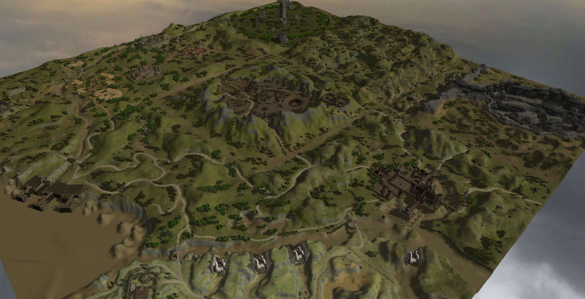
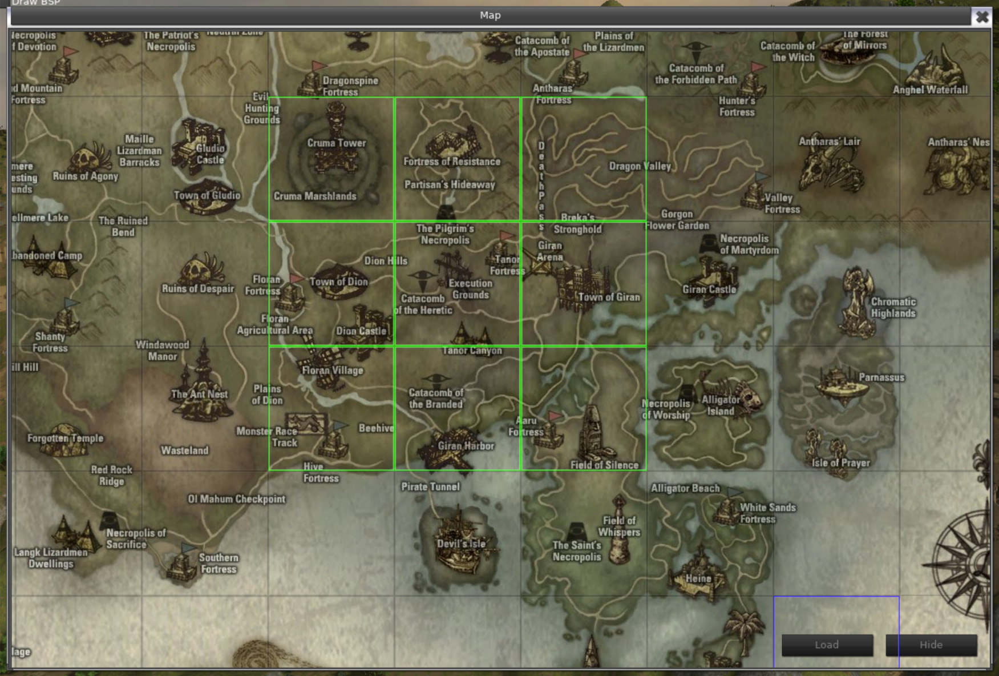
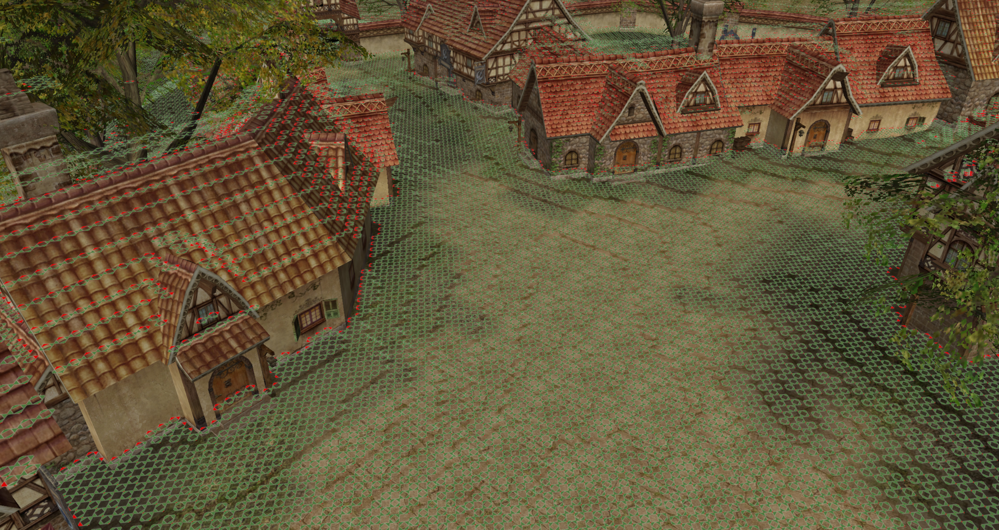

# Sedona-L2MapViewer

> Prototype status: this repository is currently a working prototype, not a finished Sedona release. Client/profile launch support, runtime bootstrap, package decoding, and map loading are present, but in-app client selection, automatic geodata generation, and the full GUI workflow are still under active implementation.

Sedona-L2MapViewer is a standalone Lineage II world/map viewer for inspecting client map packages, geometry, static meshes, textures, and L2J geodata from one desktop tool.

It reads Lineage II client packages directly, loads map tiles on demand, renders the UE2/BSP world geometry and static meshes, and includes an upgraded package decoding path for protected client files.

Long-term, Sedona is intended to become a Lineage II map builder: edit map content, browse/import assets, move compatible graphical elements between supported clients, generate geodata automatically, and export generated geodata into a separate output folder.

## Planned Builder Scope

- In-app client, donor-client, and geodata output folder selection.
- Package and asset browser for maps, static meshes, textures, systextures, animations, sounds, and system packages.
- Editor tools for selecting, moving, rotating, scaling, duplicating, deleting, and inspecting map elements.
- Cross-client asset transfer with dependency scanning and compatibility checks.
- Automatic geodata generation from terrain, BSP, static meshes, collision, and blocking data.
- Separate geodata export folder with validation and export reports.

## Current Build

The Release x64 output is:

```text
build/Sedona-L2MapViewer.exe
```

## Running

The executable expects a Lineage II client folder one level above the `build` folder.
You can override that default with a launch argument or environment variable, which is the preferred mode when switching between H5, Fafurion, and Homunculus workspaces.

Typical layout:

```text
SomeFolder/
  build/
    Sedona-L2MapViewer.exe
    data/
    resources.xml
    ...
  Maps/
  StaticMeshes/
  SysTextures/
  Textures/
  system/
```

Optional L2J geodata layout:

```text
SomeFolder/
  build/
  geodata/
    23_22.l2j
    ...
```

Controls:

- Right mouse button: rotate camera
- Mouse wheel: zoom
- W/A/S/D: move
- Space: move up
- Ctrl: move down
- Menu -> Map: open the tile selector

Client path override:

```powershell
.\build\Sedona-L2MapViewer.exe --client="C:\GITHUB\L2Modder_V2\Kliensek\Lineage II H5 Custom"
.\build\Sedona-L2MapViewer.exe --client="C:\GITHUB\L2Modder_V2\Kliensek\FULL CLIENT LINEAGE2 FAFURION REV 166 EU"
.\build\Sedona-L2MapViewer.exe --client="C:\GITHUB\L2Modder_V2\Kliensek\L2NAP286D20201216G269"
.\build\Sedona-L2MapViewer.exe --profile=H5
.\build\Sedona-L2MapViewer.exe --profile=Fafurion
.\build\Sedona-L2MapViewer.exe --profile=Homonkulus
```

Profile launcher:

```powershell
powershell -ExecutionPolicy Bypass -File .\scripts\Launch-ClientProfile.ps1 -Profile H5
powershell -ExecutionPolicy Bypass -File .\scripts\Launch-ClientProfile.ps1 -Profile Fafurion
powershell -ExecutionPolicy Bypass -File .\scripts\Launch-ClientProfile.ps1 -Profile Homonkulus
```

Quick client scan:

```powershell
powershell -ExecutionPolicy Bypass -File .\scripts\Scan-Client.ps1 -Profile All
powershell -ExecutionPolicy Bypass -File .\scripts\Test-ClientTiles.ps1 -Profile All
powershell -ExecutionPolicy Bypass -File .\scripts\Test-ClientAssets.ps1 -Profile All
```

The broader Sedona toolbox is discovered from `C:\GITHUB\L2Modder_V2`:

```powershell
powershell -ExecutionPolicy Bypass -File .\scripts\Get-L2ModderToolchain.ps1
```

The coding/export integration map is documented in `L2MODDER_INTEGRATION.md`.

## Supported Client Data

The package loader scans:

```text
Maps/*.unr
SysTextures/*.utx
Textures/*.utx
StaticMeshes/*.usx
```

Package decoding supports XOR-protected Lineage package headers internally. For newer protected files, including RSA/zlib-protected client data, the viewer falls back to `l2encdec.exe` when available.

The fallback decoder is searched in this order:

1. `L2ENCDEC_EXE` environment variable
2. next to the executable
3. `build/data/l2encdec/l2encdec.exe`
4. known local `L2Modder_V2/L2FileEdit/data/l2encdec` paths

The bootstrap step installs:

```text
build/data/l2encdec/l2encdec.exe
build/data/l2encdec/libgmp-10.dll
build/data/l2encdec/libz-1.dll
```

## Building

Prerequisites:

- Visual Studio 2022 Build Tools with C++ workload
- Windows 10 SDK
- The local runtime/dependency folders created by `scripts/Bootstrap-Runtime.ps1`

Bootstrap command for a fresh clone:

```powershell
powershell -ExecutionPolicy Bypass -File .\scripts\Bootstrap-Runtime.ps1
```

This restores the ignored `build/` runtime DLLs from the repository's `runtime/` folder. The full runtime DLL set is intentionally kept together because `MyGUIEngine.dll` requires the matching `freetype.dll` export `FT_Get_WinFNT_Header`; removing "unused-looking" DLLs can break startup on a clean machine.

This workspace has been updated to use:

- MSVC toolset: `v143`
- Windows SDK: `10.0`
- local dependency paths under `deps/`
- executable target name: `Sedona-L2MapViewer.exe`

Build command:

```powershell
& 'C:\BuildTools\MSBuild\Current\Bin\MSBuild.exe' Sedona-L2MapViewer.sln /m /p:Configuration=Release /p:Platform=x64 /v:minimal
```

Successful output:

```text
build/Sedona-L2MapViewer.exe
```

Known non-fatal linker warnings:

- `LNK4098`: runtime library mix from old third-party libs
- `LNK4099`: missing `vc120.pdb` for bundled `glew32s.lib`

## Notes

The renderer still uses legacy OpenGL in several places because Lineage II's map assets are UE2-era data, but the project build, package loading, executable naming, and decoder integration have been upgraded for the Sedona toolchain.

## Gallery





